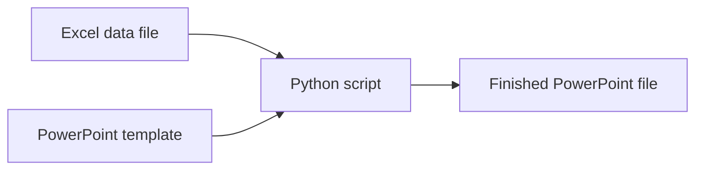
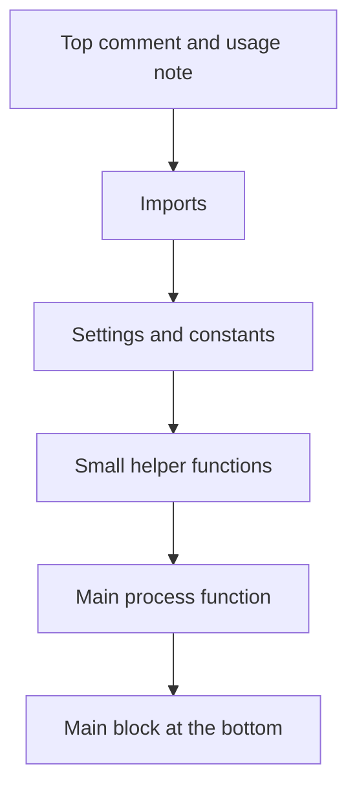
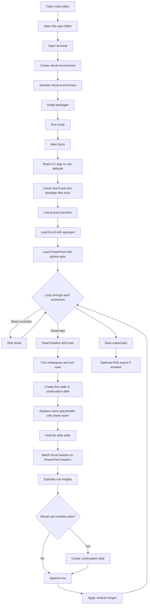

# Excel to PowerPoint Demo

Turn an Excel workbook into a PowerPoint deck.

Each worksheet becomes one or more slides.
The data comes from `data.xlsx`.
The slide design comes from `template.pptx`.
The script that does the work is `generate_slides.py`.

<a id="table-of-contents"></a>
## 📚 Table of Contents

### Start Here

- [First Note](#first-note)
- [Pick Your Path](#pick-your-path)
- [ADHD-Friendly Map](#adhd-friendly-map)
- [Tiny Python Vocabulary](#tiny-python-vocabulary)
- [Big Picture First](#big-picture-first)

### Setup and Run

- [Before You Start](#before-you-start)
- [Open the Code Editor](#open-the-code-editor)
- [Open the Terminal](#open-the-terminal)
- [Create a Virtual Environment](#create-a-virtual-environment)
- [Activate the Virtual Environment](#activate-the-virtual-environment)
- [Install the Requirements](#install-the-requirements)
- [Why the Repo Is Set Up This Way](#why-the-repo-is-set-up-this-way)
- [How to Run the Code](#how-to-run-the-code)
- [What Happens When You Run It](#what-happens-when-you-run-it)

### Learn the Code

- [Important Settings](#important-settings)
- [Code Walkthrough](#code-walkthrough)
- [Imports](#imports)
- [Helper Functions](#helper-functions)
- [The `process()` Function](#the-process-function)
- [The Entry Point at the Bottom](#the-entry-point)

### Visuals and Help

- [Mermaid Diagrams](#mermaid-diagrams)
- [Troubleshooting](#troubleshooting)
- [Final Mental Model](#final-mental-model)

<a id="first-note"></a>
## 💛 First Note

This README is written so a beginner can learn in small steps.

You do **not** need to understand everything in one sitting.

That is especially true if you have ADHD.
Short focused passes are better than forcing one long session.

Good goal for day 1:

- Open the project
- Run the script once
- See `output.pptx`

That alone is already real progress.

## 🐦 Friendly Bird Reminders

- 🐣 Starting counts.
- 🪶 Short study sessions count.
- 🐥 Re-reading counts.
- 🦜 Copying commands carefully counts.
- 🦉 Feeling confused for a moment is normal.
- 🕊️ You do not have to be fast to be doing well.

<a id="pick-your-path"></a>
## 🗺️ Pick Your Path

| If you want to... | Read this part first |
| --- | --- |
| run the project right now | `ADHD-Friendly Map` and sections `1` to `8` |
| understand the files | section `6` |
| learn Python basics from this project | `Tiny Python Vocabulary`, section `10`, section `11`, and section `12` |
| understand the full execution flow | the Mermaid diagrams near the end |

<a id="adhd-friendly-map"></a>
## 🧭 ADHD-Friendly Map

You do **not** need to understand the whole repo at once.

Start here:

- [ ] Open the folder in your code editor
- [ ] Open the terminal
- [ ] Create a virtual environment
- [ ] Activate the virtual environment
- [ ] Install the Python packages
- [ ] Run the script
- [ ] Open `output.pptx`

If you only want the shortest version, use this:

```bash
python3 -m venv .venv
source .venv/bin/activate
pip install -r requirements.txt
python3 generate_slides.py
```

Then open `output.pptx`.

> 🐣 Cheer checkpoint: starting the setup is already a win.
> Most people get stuck before they even begin.

<a id="tiny-python-vocabulary"></a>
## 🧱 Tiny Python Vocabulary

These words will appear a lot.
You do not need to memorize them.
Just use them as a reference.

| Word | Simple meaning |
| --- | --- |
| Python | The programming language used in this repo |
| script | A Python file you run, like `generate_slides.py` |
| terminal | A text window where you type commands |
| package | Extra code installed from the internet, like `openpyxl` |
| import | A line that brings a package into your script |
| function | A named block of code that does one job |
| argument | Extra information passed into a command |
| variable | A named value in code |
| constant | A variable that is meant to stay fixed |
| loop | Code that repeats over a list of things |

<a id="big-picture-first"></a>
## 🎨 Big Picture First

Before thinking about Python details, this is the whole project in one picture:



If that picture makes sense, the project already makes sense.

> 🐥 Tiny win: if you understand "Excel + template + Python = new PowerPoint", you already understand the heart of the project.

## 🎯 What This Project Does

This repo automates a very common workflow:

1. Read data from Excel.
2. Use a PowerPoint file as the visual template.
3. Create slides automatically.
4. Fill a table on each slide with rows from Excel.
5. Save the finished deck as a new `.pptx` file.

<a id="before-you-start"></a>
## 🛠️ Before You Start

You need:

| Thing | Why you need it |
| --- | --- |
| Python 3 | To run the script |
| A code editor | To open the repo and read or edit the code |
| A terminal | To create the virtual environment and run commands |
| `data.xlsx` | The input data |
| `template.pptx` | The slide design |

This repo already includes `data.xlsx` and `template.pptx`, so you can run the default command right away after setup.

<a id="open-the-code-editor"></a>
## 1. 🐣 Open the Code Editor

These steps assume VS Code, but the idea is the same in other editors.

1. Open VS Code.
2. Click **File → Open Folder**.
3. Choose this project folder.
4. Wait for the files to appear in the left sidebar.

You should see files like:

- `generate_slides.py`
- `requirements.txt`
- `data.xlsx`
- `template.pptx`

> 🪶 Nice work: opening the right folder means you are oriented.
> That is a real part of programming.

<a id="open-the-terminal"></a>
## 2. 🐤 Open the Terminal

In VS Code:

1. Click **Terminal → New Terminal**
2. A terminal panel opens at the bottom
3. Make sure you are inside this project folder

You can check with:

```bash
pwd
```

> 🐦 Good job: if your terminal is open, you are ready to talk to your computer directly.
> That is a big beginner step.

<a id="create-a-virtual-environment"></a>
## 3. 🪺 Create a Virtual Environment

A virtual environment gives this project its **own private Python packages**.

Why this is helpful:

- It keeps this repo separate from your other Python projects.
- It avoids version conflicts.
- It makes setup repeatable.

Create it with:

```bash
python3 -m venv .venv
```

This creates a folder named `.venv`.

> 🐣 Tiny victory: you just created a safe practice space for this project.
> That is exactly what good Python setup looks like.

<a id="activate-the-virtual-environment"></a>
## 4. 🦜 Activate the Virtual Environment

On macOS or Linux:

```bash
source .venv/bin/activate
```

On Windows PowerShell:

```powershell
.venv\Scripts\Activate.ps1
```

When it works, your terminal usually shows something like `(.venv)` at the start of the line.

Optional VS Code step:

1. Press `Cmd + Shift + P` on macOS, or `Ctrl + Shift + P` on Windows/Linux
2. Search for `Python: Select Interpreter`
3. Choose the interpreter inside `.venv`

> 🪶 Great job: once you see `(.venv)`, your project is using its own Python environment.
> That is a really useful skill.

<a id="install-the-requirements"></a>
## 5. 🦉 Install the Requirements

This repo uses a `requirements.txt` file.

That file lists the Python packages this project needs.

Install them with:

```bash
pip install -r requirements.txt
```

### What the requirements do

| Package | Why it is here |
| --- | --- |
| `python-pptx` | Opens and writes PowerPoint files |
| `openpyxl` | Reads Excel workbooks and worksheet data |
| `lxml` | Edits PowerPoint table XML more precisely than `python-pptx` alone |

Optional note:

- If you turn on `EXPORT_PNGS = True` in the script, you will also need `Pillow`.
- Install it with `pip install Pillow`.

> 🐥 Another win: installing requirements means the project now has the tools it needs.
> You are building a real working environment.

<a id="why-the-repo-is-set-up-this-way"></a>
## 6. 🕊️ Why the Repo Is Set Up This Way

This project is intentionally simple.

| File | Purpose | Why that is useful |
| --- | --- | --- |
| `generate_slides.py` | The main script | Keeps the automation logic in one place |
| `data.xlsx` | Input data | Non-developers can update content without editing Python |
| `template.pptx` | Slide layout and design | The script changes content without rebuilding the presentation style |
| `requirements.txt` | Dependency list | Makes setup predictable |
| `output.pptx` | Generated presentation | Gives you a finished deck after running the script |
| `output/` and `output_slide*.png` | Sample or optional exported images | Helpful for checking layout or sample output |
| `.gitignore` | Ignore temp and local Office-related files | Helps reduce clutter in Git |

### Why this structure works well

- The **Excel file** owns the data.
- The **PowerPoint template** owns the look and layout.
- The **Python script** owns the logic.

That separation is nice because:

- You can change the data without changing the code.
- You can restyle the slides without rewriting the data logic.
- You can keep the script focused on automation.

> 🦜 Understanding the file roles is a programming win too.
> You are learning structure, not just commands.

<a id="how-to-run-the-code"></a>
## 7. 🐦 How to Run the Code

If you keep the default file names, run:

```bash
python3 generate_slides.py
```

That uses these built-in defaults:

| Argument | Default value |
| --- | --- |
| Excel file | `data.xlsx` |
| Template file | `template.pptx` |
| Output file | `output.pptx` |

You can also pass all three file names yourself:

```bash
python3 generate_slides.py data.xlsx template.pptx output.pptx
```

### What each part of the command means

| Part | Meaning |
| --- | --- |
| `python3` | Run the script with Python 3 |
| `generate_slides.py` | The script file |
| `data.xlsx` | The Excel workbook to read |
| `template.pptx` | The PowerPoint template to copy |
| `output.pptx` | The name of the finished PowerPoint file |

> 🐣 If you can read that command left to right, you are already getting more comfortable with the terminal.

<a id="what-happens-when-you-run-it"></a>
## 8. 🐥 What Happens When You Run It

Here is the high-level flow:

1. The script checks that the Excel file exists.
2. The script checks that the PowerPoint template exists.
3. It opens the Excel workbook.
4. It opens the PowerPoint template.
5. It loops through each worksheet in Excel.
6. It skips any sheet listed in `EXCLUDE_SHEETS`.
7. It creates or clones a slide from the template.
8. It replaces `{{name}}` with the sheet name.
9. It finds the table on the slide.
10. It matches Excel headers to PowerPoint table headers.
11. It cleans and sorts the rows.
12. It adds rows into the slide table.
13. If the slide gets too full, it creates continuation slides.
14. It applies vertical merges where configured.
15. It saves the final deck.

### What success looks like

In this repo, a successful run prints output similar to this:

```text
Sheets found: John, Bob, Alice

Sheet 'John': 14 data row(s), columns: ['Goal', 'Metric']
  Matched : ['Goal', 'Metric']
[SKIP] 'Bob': in exclude list.
Sheet 'Alice': 47 data row(s), columns: ['Goal', 'Goal2', 'Metric', 'Metric2']
  Matched : ['Goal', 'Goal2', 'Metric', 'Metric2']

Done — 9 slide(s) created
Output saved to: output.pptx
```

> 🦉 Big win: if you reached this point and created `output.pptx`, you just ran a real Python project successfully.
> That is not small.
> ✅ You can stop here for today if you want.
> Everything below is the "learn how the code works" part.
> You can come back later when your brain has more energy.

<a id="important-settings"></a>
## 9. ⚙️ Important Settings in `generate_slides.py`

Near the top of the script there is a configuration block.

That block is useful because it lets you change behavior **without** rewriting the main logic.

### Current settings in this repo

| Setting | Current value | What it does |
| --- | --- | --- |
| `NAME_PLACEHOLDER` | `{{name}}` | Replaces this text in the slide with the sheet name |
| `OVERFLOW_SLIDES` | `True` | Creates extra slides if the table grows too tall |
| `EXCLUDE_SHEETS` | `["Bob"]` | Skips the `Bob` worksheet completely |
| `MERGE_COLUMNS` | `["Goal", "Goal2", "Metric"]` | Merges repeated values vertically in those columns |
| `SORT_COLUMNS` | `["Goal", "Goal2", "Metric"]` | Sorts rows before inserting them |
| `STRIP_WHITESPACE` | `True` | Trims extra spaces from text |
| `BOTTOM_PADDING_ROWS` | `0` | Leaves no extra reserved blank rows at the bottom |
| `OVERFLOW_SENSITIVITY` | `0.75` | Controls how early the script decides a slide is too full |
| `EXPORT_PNGS` | `False` | Does not export layout PNGs by default |
| `ALTERNATING_ROW_COLORS` | `True` | Alternates row band colors by grouped value |
| `ALTERNATING_ROW_COLOR` | `#E7F1EA` | The tint used for alternating row bands |
| `BOLD_COLUMNS` | `["Goal"]` | Makes the `Goal` column bold in data rows |

<a id="code-walkthrough"></a>
## 10. 🧠 Code Walkthrough

The file is organized in a beginner-friendly order.

### How to read this file without getting overwhelmed

Use this order:

1. Read the top comment to learn what the script does.
2. Glance at the imports.
3. Look at the settings block near the top.
4. Skim the helper function names only.
5. Read `process()` because it is the main workflow.
6. Read the bottom `if __name__ == "__main__":` block last.

You do **not** need to fully understand:

- XML details on the first pass
- every constant near the top
- every helper function before reading `process()`

> 🪶 Gentle reminder: skimming counts.
> You do not need perfect understanding on the first read.

### Visual layout of the Python file



| Part of the file | Why it exists |
| --- | --- |
| Module docstring at the top | Gives a plain-English summary and usage example |
| Imports | Loads the libraries the script needs |
| Configuration constants | Puts the easy-to-change settings in one place |
| XML and measurement constants | Stores shared values used in table layout math |
| Helper functions | Breaks the work into small focused pieces |
| `export_slide_pngs()` | Optionally draws PNG previews of slide layouts |
| `process()` | The main orchestration function |
| `if __name__ == "__main__":` | Acts like the program's main entry point |

### A note about "main"

Python does not require a `main()` function.

In this script:

- `process()` is the main workhorse
- `if __name__ == "__main__":` is the part that runs when you execute the file directly

That setup is useful because:

- The bottom block stays short and easy to read.
- `process()` can be reused or tested separately.

> 🐣 Nice job: if you understand that the bottom block starts the script and `process()` does the work, you already understand a very important Python pattern.

<a id="imports"></a>
## 11. 🧩 Imports: What They Do

| Import | Why it is needed |
| --- | --- |
| `copy` | Duplicates template slide XML safely |
| `sys` | Exits with readable error messages |
| `Path` from `pathlib` | Checks whether input files exist |
| `openpyxl` | Loads the Excel workbook |
| `etree` from `lxml` | Builds and edits PowerPoint table XML |
| `Presentation` from `pptx` | Opens and saves the PowerPoint file |

### Why imports come first in Python files

Imports are near the top because the script needs those tools before it can do its work.

A good mental model is:

- first bring in tools
- then define settings
- then define functions
- then run the main workflow

> 🐦 Tiny win: if "imports bring in tools" makes sense, you learned something foundational.

<a id="helper-functions"></a>
## 12. 🛠️ Helper Functions Explained

Think of the helper functions as small tools.
Each tool has one job.
That makes the code easier to read, debug, and change.

| Helper function | What it does | Why it is useful |
| --- | --- | --- |
| `detect_font_size(tr)` | Looks for font size inside a template row | Keeps inserted rows visually consistent with the template |
| `detect_para_spacing(trs)` | Reads paragraph spacing from template rows | Makes row-height estimates more accurate |
| `_word_wrap_lines(text, usable_w_emu, font_size_pt)` | Estimates how many wrapped lines a cell will need | Helps predict overflow before rows are added |
| `get_table_shape(slide)` | Finds the first table on a slide | Gives the script the table it needs to fill |
| `cell_text(cell)` | Returns clean text from a table cell | Makes header matching simpler |
| `estimate_row_height(...)` | Predicts how tall a row will be | Prevents text from running off the slide |
| `append_data_row(...)` | Builds a new PowerPoint table row from scratch | Avoids formatting problems and non-editable pasted cells |
| `replace_placeholder(slide, placeholder, value)` | Replaces `{{name}}` with the sheet name | Personalizes each slide for each worksheet |
| `make_slide_from_template(...)` | Creates a fresh slide from the template shape tree | Keeps every new slide visually consistent |
| `apply_vertical_merges(...)` | Merges repeated values vertically in chosen columns | Makes grouped data easier to read |
| `export_slide_pngs(...)` | Creates PNG layout previews when enabled | Helps debug overflow and layout without opening PowerPoint |

### Why helper functions are a good design choice here

- They keep `process()` from becoming one giant unreadable block.
- They make the code easier to reason about.
- They separate PowerPoint logic, Excel logic, and layout math.
- They make future changes safer.

> 🐥 Important beginner win: understanding that functions are small reusable jobs is one of the best things to learn early in Python.

<a id="the-process-function"></a>
## 13. 🏗️ The `process()` Function

`process()` is the center of the script.

It does the full job:

1. Load the workbook.
2. Load the presentation.
3. Loop over worksheets.
4. Skip excluded sheets.
5. Read headers and rows.
6. Clean and sort data.
7. Create a slide.
8. Match Excel columns to PowerPoint columns.
9. Remove placeholder rows from the template table.
10. Estimate row heights.
11. Add rows.
12. Create continuation slides if needed.
13. Apply vertical merges.
14. Save the final PowerPoint file.

Why this function is set up this way:

- It centralizes the workflow.
- It keeps the script easy to follow from top to bottom.
- It uses helpers for the tricky details.

> 🦜 Big picture win: if you can say "`process()` is the main workflow", then you are reading code structurally, which is excellent progress.

<a id="the-entry-point"></a>
## 14. 🚀 The Entry Point at the Bottom

The bottom of the file does four simple things:

1. Read command-line arguments
2. Fall back to defaults if arguments were not given
3. Check that the Excel and template files exist
4. Call `process(...)`

That is a clean pattern because:

- the startup logic stays tiny
- the real work stays inside `process()`
- errors happen early and clearly

> 🪶 You are doing well if this part feels more readable than before.
> That means the structure is starting to click.

### Tiny experiments you can try next

These are good beginner experiments because they are small and safe.

1. Change the output file name in the command.

```bash
python3 generate_slides.py data.xlsx template.pptx my_output.pptx
```

Why this helps:
It teaches that scripts can take arguments.

2. Remove `"Bob"` from `EXCLUDE_SHEETS` and run the script again.

Why this helps:
It teaches that changing a constant changes the script's behavior.

3. Change `ALTERNATING_ROW_COLOR` to another hex color.

Why this helps:
It shows that Python settings can control visual output.

4. Turn `EXPORT_PNGS` from `False` to `True`.

Why this helps:
It teaches that a Boolean setting can turn a feature on or off.

> 🐣 Brave beginner bonus: changing one small thing and running the script again is exactly how confidence grows.

<a id="mermaid-diagrams"></a>
## 15. 🗺️ Mermaid Diagrams

### Diagram 1: Setup + Runtime Overview

This first diagram shows the full setup path plus the high-level runtime flow.



### Diagram 2: Detailed Runtime Diagram

This second diagram focuses only on what happens while the Python code is running.
It is the detailed step-by-step execution flow you asked for.

You can skip this diagram on your first read.
It is here when you want the deeper view.

> 🦉 This diagram is for curiosity, not pressure.
> You do not need to memorize it.

```mermaid
flowchart TD
    A[Start script] --> B[Main block runs]
    B --> C[Read command line arguments]
    C --> D[Use defaults if args are missing]
    D --> E[Check Excel file exists]
    E --> F[Check template file exists]
    F --> G[Call process function]

    G --> H[Prepare config values]
    H --> I[Load workbook with openpyxl]
    I --> J[Load presentation]
    J --> K{Does template contain at least one slide?}
    K -->|No| L[Exit with error]
    K -->|Yes| M[Snapshot template slide and shape tree]
    M --> N[Read workbook sheet names]
    N --> O{For each sheet}

    O --> P{Is sheet excluded}
    P -->|Yes| Q[Print skip message]
    Q --> O
    P -->|No| R[Open worksheet]

    R --> S[Read headers from row 1]
    S --> T{Any headers found?}
    T -->|No| U[Print skip message]
    U --> O
    T -->|Yes| V[Read non-empty data rows]
    V --> W{Trim whitespace}
    W -->|Yes| X[Trim string values]
    W -->|No| Y[Keep raw values]
    X --> Z
    Y --> Z
    Z{Sort columns found} -->|Yes| AA[Sort rows in memory]
    Z -->|No| AB[Keep original row order]

    AA --> AC{First sheet being used?}
    AB --> AC
    AC -->|Yes| AD[Reuse first template slide]
    AC -->|No| AE[Clone a new slide from template]
    AD --> AF[Replace name placeholder with sheet name]
    AE --> AF

    AF --> AG[Find first table on slide]
    AG --> AH{Table found?}
    AH -->|No| AI[Warn and skip sheet]
    AI --> O
    AH -->|Yes| AJ[Read PowerPoint header row]
    AJ --> AK[Match PowerPoint headers to Excel headers]
    AK --> AL{Any matching columns?}
    AL -->|No| AM[Warn and skip sheet]
    AM --> O
    AL -->|Yes| AN[Detect font size from template rows]
    AN --> AO[Detect paragraph spacing]
    AO --> AP[Read header row height]
    AP --> AQ[Remove template placeholder rows]
    AQ --> AR[Read column widths]
    AR --> AS[Set alternating row color state]
    AS --> AT[Compute bottom padding and slide fill height]
    AT --> AU{Need merge precompute}
    AU -->|Yes| AV[Mark cells that belong to merge spans]
    AU -->|No| AW[Continue]
    AV --> AX[Prepare current slide layout tracking]
    AW --> AX

    AX --> AY{For each data row}
    AY --> AZ[Choose row background color]
    AZ --> BA{Use overflow slides}
    BA -->|No| BB[Append row directly]
    BB --> AY

    BA -->|Yes| BC[Build effective row for height estimate]
    BC --> BD[Estimate row height]
    BD --> BE{Would row overflow current slide and there is already a row present?}
    BE -->|No| BF[Append row to current table]
    BF --> BG[Update running height and layout info]
    BG --> AY

    BE -->|Yes| BH{Use merged columns}
    BH -->|Yes| BI[Apply vertical merges to current table before spilling]
    BH -->|No| BJ[Skip pre-spill merge step]
    BI --> BK[Create continuation slide]
    BJ --> BK
    BK --> BL[Add continuation label]
    BL --> BM[Find table on continuation slide]
    BM --> BN[Remove placeholder rows from continuation table]
    BN --> BO[Reset height counters and layout tracking]
    BO --> BP[Append current row to continuation slide]
    BP --> BQ[Update running height and layout info]
    BQ --> AY

    AY -->|No more rows| BR{Use merged columns}
    BR -->|Yes| BS[Apply vertical merges to final table for this sheet]
    BR -->|No| BT[Skip merge step]
    BS --> O
    BT --> O

    O -->|No more sheets| BU[Save presentation to output path]
    BU --> BV{Export PNG layouts}
    BV -->|Yes| BW[Start PNG export]
    BV -->|No| BX[Finish]
    BW --> BY{Is Pillow installed?}
    BY -->|No| BZ[Warn and skip PNG export]
    BY -->|Yes| CA[Draw one PNG layout per slide]
    BZ --> BX
    CA --> BX
```



<a id="troubleshooting"></a>
## 16. 🧪 Troubleshooting

| Problem | Usually means | What to do |
| --- | --- | --- |
| `ModuleNotFoundError` | Packages are not installed in the current environment | Activate `.venv` and run `pip install -r requirements.txt` |
| `Error: Excel file not found` | The Excel file name or path is wrong | Make sure `data.xlsx` exists in the project folder, or pass the correct file name |
| `Error: Template file not found` | The PowerPoint template name or path is wrong | Make sure `template.pptx` exists in the project folder, or pass the correct file name |
| No rows appear in the table | Excel headers do not exactly match the PowerPoint table headers | Make the column names match exactly |
| A worksheet is missing from the output | It may be listed in `EXCLUDE_SHEETS` | Check the config block near the top of `generate_slides.py` |
| You want PNG layout previews | `EXPORT_PNGS` is still off | Set `EXPORT_PNGS = True` and install `Pillow` |

<a id="final-mental-model"></a>
## 17. ✅ Final Mental Model

If you remember only one thing, remember this:

- Excel provides the content.
- PowerPoint provides the design.
- Python connects the two.

That is the whole idea of this repo.
